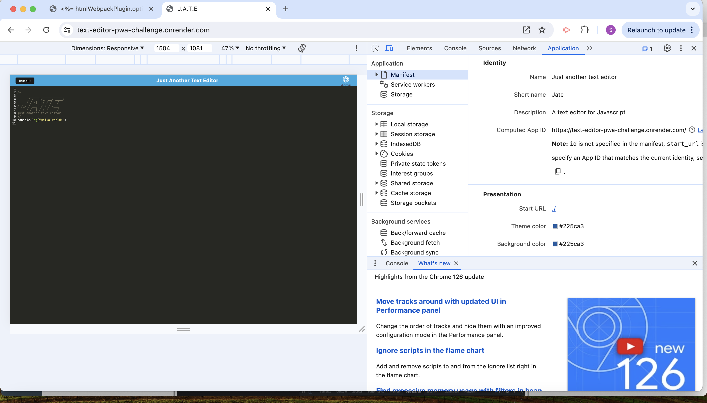
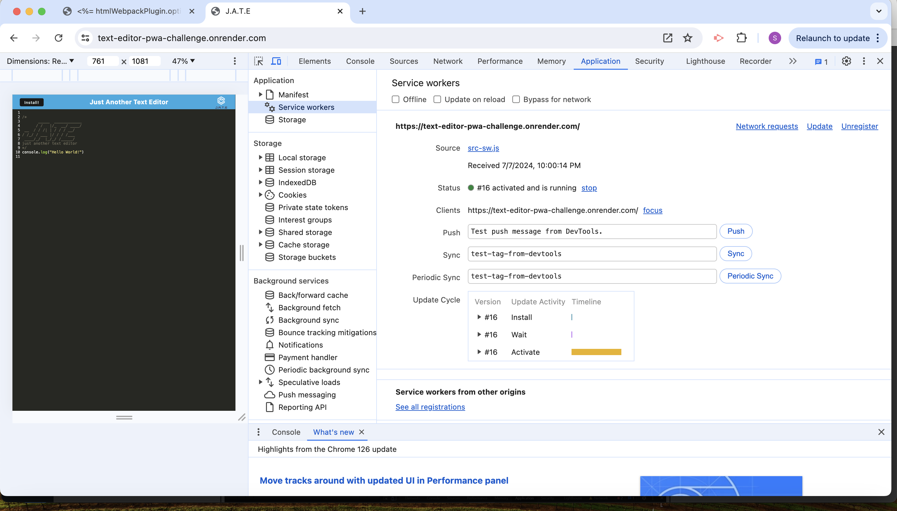
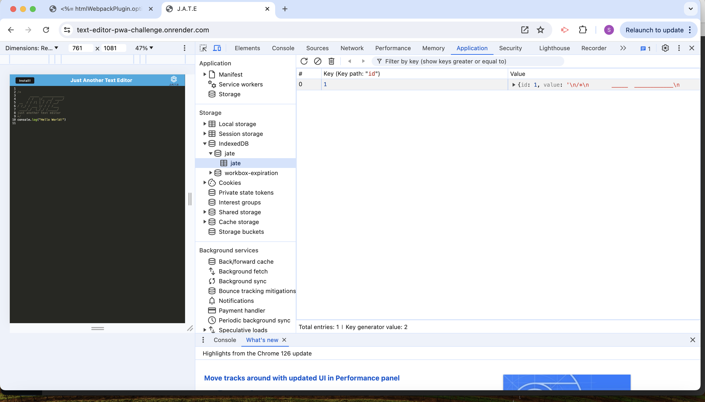

# Text Editor Starter

# Table of Contents

- [Description](#description)
- [Element Challenge](#element-challenge)
- [Installation](#installation)
- [Usage](#usage)
- [Contribution](#contribution)
- [License](#license)

## Description
A text editor that runs in the browser. This app is a single-page application that meets the PWA criteria. Additionally, it features a number of data persistence techniques that serve as redundancy in case one of the options is not supported by the browser. The application also functions offline.

## Challenge Elements

User Story

AS A developer
I WANT to create notes or code snippets with or without an internet connection
SO THAT I can reliably retrieve them for later use
Acceptance Criteria

GIVEN a text editor web application
WHEN I open my application in my editor
THEN I should see a client server folder structure
WHEN I run `npm run start` from the root directory
THEN I find that my application should start up the backend and serve the client
WHEN I run the text editor application from my terminal
THEN I find that my JavaScript files have been bundled using webpack
WHEN I run my webpack plugins
THEN I find that I have a generated HTML file, service worker, and a manifest file
WHEN I use next-gen JavaScript in my application
THEN I find that the text editor still functions in the browser without errors
WHEN I open the text editor
THEN I find that IndexedDB has immediately created a database storage
WHEN I enter content and subsequently click off of the DOM window
THEN I find that the content in the text editor has been saved with IndexedDB
WHEN I reopen the text editor after closing it
THEN I find that the content in the text editor has been retrieved from our IndexedDB
WHEN I click on the Install button
THEN I download my web application as an icon on my desktop
WHEN I load my web application
THEN I should have a registered service worker using workbox
WHEN I register a service worker
THEN I should have my static assets pre cached upon loading along with subsequent pages and static assets
WHEN I deploy to Render
THEN I should have proper build scripts for a webpack application

## Installation

- Git clone https://github.com/saba0705/Text-Editor-PWA-Challenge to clone the repository.
- Install the dependencies using npm install.
- Use npm run start to start the server at localhost 3000

## Usage
- Uses IndexedDB to create an object store and includes both GET and PUT methods
- The application works without an internet connection
- Automatically saves content inside the text editor when the DOM window is unfocused
- Bundled with webpack
- Create a service worker with workbox that Caches static assets
- The application should use babel in order to use async / await
- Application must have a generated manifest.json using the WebpackPwaManifest plug-in
- Can be installed as a Progressive Web Application

## Contributions

We'd love for you to contribute! In order to do so, fork this repository. Your pull request will need approval in order to merge to main.

## License

Copyright (c) Saba Pervez. All rights reserved.

Licensed under the MIT license.

render deployed link : https://text-editor-pwa-challenge.onrender.com 

